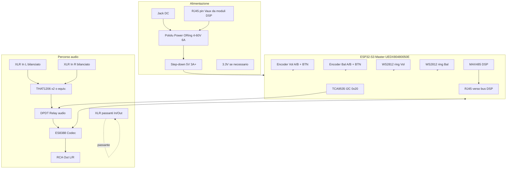

# Cablaggio completo – Box Master + Box Slave/Wireless

Documento di riferimento per assemblaggio, **allineato ai PDF in `docs/`** (UEDX, M144, ES8388, Relè, Encoder, Pololu ORing, MAX485, Led Ring).  
Sintesi tecnica centralizzata: **[`DATASHEETS_REFERENCE.md`](DATASHEETS_REFERENCE.md)**.

---

## 0. PDF in repository (fonte ufficiale)

| File | Ruolo |
|------|--------|
| **UEDX80480050E-WB-A-V3.3-SPEC.pdf** | Modulo 5" + ESP32-S3: **5 V ~300 mA** max, J2 GPIO, TP GT911 |
| **M144_sch_moduleaudio_v10.pdf** | Modulo M5 **ES8388**: I2S (SCLK/DSDIN/LRCK/ASDOUT), jack PJ-342B, BUS |
| **ES8388.pdf** | Datasheet codec |
| **Relè Module interface.pdf** | **DC+ DC− IN**, **NO COM NC**, jumper LOW/HIGH trigger |
| **Encoder rotativo.pdf** | **EC11**, 5 V, **7 pin** |
| **pololu-power-oring-ideal-diode-pair.pdf** | **Pololu #5398**, 4–60 V, 6 A, **VIN1/VIN2/VOUT** |
| **MAX485.pdf** | **DI RO DE RE A B** |
| **Led Ring WS2811.pdf** | Anello LED (5 V tip., DIN, GND) |

**UEDX – I2S (SPEC):** GPIO **11** = RTP-DIN (dato verso ESP), **12** = BCLK, **13** = linea I2S verso codec (LRCK/DOUT secondo routing). Coerente con `config.h` (I2S_DIN/BCLK/WS).

**UEDX – conflitto GPIO38:** sulla SPEC, **GPIO38** = **reset touch (TP pin 6)**. Il firmware assegna **GPIO38 = I2S_DOUT**. Sul PCB UEDX il pin è condiviso con il touch: verificare schema **V3.3**; se necessario spostare **I2S_DOUT** su altro GPIO libero e aggiornare `config.h`, oppure usare **solo modulo M144** collegato con fili corti e I2S su header non in conflitto con display.

---

## 1. Box Master – panoramica blocchi



---

## 2. Alimentazione – Jack + RJ45 Vaux (Pololu #5398, da PDF Pololu)

**Modulo:** *Power ORing Ideal Diode Pair* – **4–60 V**, **6 A per canale**, uscita **VOUT**. Ogni ingresso ha **VINx** (diretto) e **VINxR** (attraverso ~20 mΩ per bilanciamento).

| Pad Pololu | Collegamento consigliato |
|------------|---------------------------|
| **VIN1** o **VIN1R** + GND | Jack DC box (es. 12–19 V) |
| **VIN2** o **VIN2R** + GND | **RJ45** alimentazione ausiliaria moduli DSP (**polarità da verificare**) |
| **VOUT** + GND | → **Buck 5 V ≥ 3 A** → **UEDX 5 V** (SPEC: 5 V 1 A consigliati; 300 mA tip. max backlight) |

```text
  Jack+ ──► VIN1 (o VIN1R)     RJ45 V+ ──► VIN2 (o VIN2R)
  GND  ──► GND comune         GND     ──► GND
                    VOUT+ ──► Buck 5V ──► +5V UEDX / M5 / periferiche
```

**Nota Pololu:** le due sorgenti sono in **OR** (tensione più alta tende a fornire); per condivisione carico usare tensioni vicine o resistenza serie su ingresso più alto.

**Avvertenze**

- Non assumere mai la polarità dei pin RJ45 dei moduli DSP senza datasheet.
- Fusibile o polyswitch su **ogni** ingresso DC consigliato.
- GND comune tra Master, Slave (se collegato), RS-485, ES8388 analog ground (stella verso un punto).

---

## 2b. Modulo audio M5 (M144) + ES8388 – da M144_sch_moduleaudio_v10.pdf

| Segnale | ES8388 (pin) | Verso ESP32-S3 (firmware) |
|---------|--------------|---------------------------|
| BCLK | SCLK (5) | GPIO **12** |
| DAC data | DSDIN (6) | GPIO **38** (⚠ conflitto touch UEDX) |
| LRCK | (7) | GPIO **13** |
| ADC data | ASDOUT (8) | GPIO **11** |
| I2C codec | CE/CDATA/CCLK → BUS SDA/SCL | Stesso bus **GPIO19/20** + pull-up 2k2 |

Uscite cuffia / linea: **LOUT1/ROUT1** → jack **PJ-342B** (J1/J2) con **22 Ω** serie. Ingressi linea: **CODEC_LIN1/RIN1**, **LIN2/RIN2**.

---

## 3. RS-485 DSP – MAX485 (datasheet) + RJ45

**MAX485:** **DI**←TX MCU, **RO**→RX MCU, **DE**+**RE** insieme, **A/B** bus. **DMX** = stesso tipo di transceiver ma **altro modulo** e **250 kbaud** sullo Slave.

### 3.1 Collegamento Master → MAX485 → RJ45

| ESP32 Master | MAX485 (DSP) | RJ45 (suggerito – adattare al tuo cavo) |
|--------------|--------------|----------------------------------------|
| GPIO43 TX | DI | — |
| GPIO44 RX | RO | — |
| GPIO10 | DE + /RE (insieme) | — |
| GND | GND | Pin **1** (schermo/GND) |
| — | **A** | Pin **4** (D+) – *da allineare ai moduli* |
| — | **B** | Pin **5** (D−) |

**Standard de facto spesso usato (non IEEE Ethernet):**

| Pin RJ45 (T568B) | Uso tipico bus RS-485 custom |
|------------------|------------------------------|
| 1 | GND / schermo |
| 2 | GND |
| 3 | riservato |
| 4 | RS-485 **A** |
| 5 | RS-485 **B** |
| 6 | riservato |
| 7 | **V+ ausiliario** (verso ORing IN2) – *solo se modulo lo fornisce* |
| 8 | **GND alimentazione** |

**Verifica obbligatoria** su primo modulo DSP: continuità A/B e tensione pin 7–8.

Terminazione **120 Ω** tra A e B sull’**ultima** presa della catena (o solo sul box se punto unico).

---

## 4. Ingressi audio bilanciati (XLR) → sbilanciato → ES8388

L’**ES8388** accetta ingressi **linea sbilanciati** (tipicamente **LIN1/RIN1** verso massa analogica). Da **XLR bilanciato** serve un **ricevitore differenziale**.

### Componente consigliato (per canale)

| Parte | Funzione | Note |
|-------|----------|------|
| **THAT1206** (THAT Corporation) | Ricevitore linea bilanciato → uscita single-ended | CMRR elevato, rumore basso – **2 chip per stereo L/R** |
| Alternativa | **SSM2142** / **INA137** (stereo) | Simile impiego |
| Economica | **Op-amp + 3 resistori** per canale (diff amp) | Più rumore/CMRR peggiore |

### Schema concettuale (per canale)

```text
  XLR pin 2 (+) ──► IN+  THAT1206
  XLR pin 3 (−) ──► IN−
  XLR pin 1 (GND) ─┴─► GND analogico
                       │
                       └── OUT (single) ──► AC couple (10µF) ──► attenuatore se serve ──► ES8388 LINx/RINx
```

- **Gain**: THAT1206 ha gain fisso ~0 dB verso uscita; regolare **PGA ES8388** (firmware già usa `setADCGain`).
- **Protezione**: diodi BAV99 verso rail su ingresso XLR se ambiente live.

### XLR passanti (through)

- **In passante**: sorgente esterna → **primario** percorso verso PA (non interrotto).
- **Derivazione**: da stesso punto (o secondario trasformatore) si può prendere copia verso **THAT1206** solo per **monitor/controllo** – oppure relay DPDT sceglie tra “linea diretta mixer” e “percorso test tone DAC” come da firmware (`MixerPassThrough` vs `TestTone`).

Il **relay DPDT** nel firmware: **TCA9535 P0_0** HIGH = TestTone (DAC), LOW = pass-through mixer – **coerente con uno switch analogico** tra due sorgenti verso l’uscita monitor/RCA.

---

## 5. Uscite ES8388 → RCA

| ES8388 (tipico breakout M5Stack / Atom) | RCA |
|----------------------------------------|-----|
| LOUT1 / ROUT1 (o HP out se usato) | RCA centrale |
| AGND | RCA schermo |

Usare cavi corti; massa RCA collegata al **punto stella** analogico.

---

## 6. Encoder EC11 + LED ring (Encoder.pdf + Led Ring.pdf)

**Encoder:** modello **EC11**, **5 V**, 7 pin (A, B, COM, SW, …). **LED ring:** **5 V**, **DIN** + GND, 100 nF vicino al primo LED.

Da **`config.h`** / firmware:

| Funzione | GPIO Master | Collegamento fisico |
|----------|-------------|---------------------|
| Encoder **Volume** A (CLK) | **GPIO35** | Terminale A encoder |
| Encoder **Volume** B (DT) | **GPIO36** | Terminale B encoder |
| Encoder **Volume** pulsante | **GPIO37** | Un pin a BTN, altro a GND (pull-up interno) |
| **WS2812 ring Volume** DATA | **GPIO27** | DIN primo LED anello (5 V + condensatore 100 µF vicino anello) |
| Encoder **Balance** A | **GPIO33** | |
| Encoder **Balance** B | **GPIO34** | |
| Encoder **Balance** pulsante | **GPIO26** | |
| **WS2812 ring Balance** DATA | **GPIO28** | |

**LED WS2812B:** alimentazione **5 V**; livello dati 3.3 V spesso sufficiente; se instabile, **level shifter** 74HCT245 o 1 MOS per linea DATA. **Resistore serie 330 Ω** su ogni DATA.

**Pulsanti:** firmware assume **LOW = premuto** (pull-up interno).

---

## 7. Relay (modulo Relè interface.pdf) + TCA9535

Modulo relè tipico: **DC+ DC−** bobina, **IN** logica, **NO / COM / NC** contatti. Jumper **LOW** = attivo basso su **IN**.

| Da TCA9535 P0_0 (o GPIO 3.3 V) | Verso modulo relè |
|---------------------------------|-------------------|
| Open collector / NPN collettore | **IN** (se jumper LOW: GND = attiva bobina via transistor) |
| Modulo **DC+** | **5 V o 12 V** bobina (secondo modulo) |
| **COM / NO / NC** | Percorso audio **DPDT** (Mixer pass-through vs test tone) |

Il firmware oggi usa indice **RELAY_PIN = 0** (TCA9535): implementare **scrittura I2C** su expander per pilotare **IN** del modulo relè (non `pinMode` su GPIO0).

---

## 8. I2S ESP32 Master ↔ ES8388

| Segnale | GPIO Master | ES8388 |
|---------|-------------|--------|
| BCLK | **12** | BCLK |
| WS (LRCK) | **13** | LRCK |
| DIN (ESP ← ADC) | **11** | DOUT |
| DOUT (ESP → DAC) | **38** | DIN |
| I2C SDA/SCL | (stesso bus codec + TCA9535 + GT911) | SDA/SCL |
| Indirizzo I2C | — | **0x10** |

---

## 9. Box Slave / Wireless (secondo ESP32 + DMX + opzionale ES8388)

### 9.1 Come da firmware attuale (`firmware/esp32_slave`)

| Funzione | GPIO Slave | Connettore / nota |
|----------|------------|-------------------|
| I2S BCLK in | 5 | Da Master GPIO12 |
| I2S WS in | 6 | Da Master GPIO13 |
| I2S DIN | 7 | Fan-out da ES8388 DOUT Master |
| IPC RX / TX | 2 / 1 | UART verso Master |
| **DMX TX** | **8** | → **MAX485 #2** DI |
| **DMX DE** | **9** | MAX485 DE+/RE- HIGH |
| MAX485 A/B | — | **XLR 3 pin** (pin 3+, 2−, 1 gnd) |
| Relay | 10 | Opzionale |
| Strobe | 11 | Opzionale |

**Secondo MAX485:** dedicato al **DMX 250 kbaud** (firmware); **non** condividere lo stesso transceiver del bus DSP 115200 senza multiplexing complesso.

### 9.2 Estensione “Slave con ES8388” (Atomstack / schematico tuo)

Se aggiungi uno **Slave con ES8388** (monitor locale o seconda coppia RCA/XLR):

- **I2S Slave** resta per **FFT / ESP-NOW** (clock dal Master).
- **ES8388 sullo Slave** richiede **altri GPIO** I2S + I2C e **non è nel firmware Slave attuale** – da progettare (es. I2S master locale solo per quel codec, o secondo bus).

Schema logico proposto per **box Slave autonomo**:

```text
  ESP32-S3 Slave
    ├── MAX485 #2 ──► XLR DMX out
    ├── RJ45 ──► stesso bus RS-485 DSP (opzionale, se vuoi slave sul bus)
    ├── XLR audio out (opz.) ──► da DAC esterno o futuro ES8388
    ├── Alimentazione 5 V (da ORing condiviso o buck locale)
    └── Antenna IPEX → ESP-NOW
```

Inserisci lo **schematico Atomstack** nella cartella `docs/hardware/` (PDF) e aggiorna questa tabella con i pin reali.

---

## 10. Riepilogo connettori pannello – Box Master

| Connettore | Funzione |
|------------|----------|
| Jack DC | Alimentazione principale → ORing IN1 |
| RJ45 | Bus RS-485 DSP + (opz.) Vaux → ORing IN2 |
| XLR F/M | In L / In R bilanciati → THAT1206 |
| XLR passanti | Catena verso PA |
| RCA | Monitor / registrazione da ES8388 DAC |
| USB-C | Programmazione ESP (se presente sulla UEDX) |

---

## 11. Riepilogo connettori – Box Slave

| Connettore | Funzione |
|------------|----------|
| XLR 3 pin | **DMX OUT** (da MAX485 #2) |
| XLR (opz.) | Audio out (futuro ES8388) |
| RJ45 | Bus DSP (se slave sul bus) |
| Header 7 fili | Verso Master (I2S + UART + GND) |

---

## 12. File correlati nel repo

| File | Contenuto |
|------|-----------|
| **`docs/DATASHEETS_REFERENCE.md`** | Sintesi da **tutti i PDF** |
| `docs/WIRING_GUIDE.md` | Dual-ESP32 7 fili |
| `docs/PINOUT_REFERENCE.md` | GPIO Master/Slave |
| `docs/DISPLAY_SETUP.md` | Display + touch + UEDX SPEC |
| `docs/SCHEMATICS.md` | Indice + link schema HTML |
| `docs/SCHEMATIC_DSP_CONNECTIONS.html` | Schemi completi stampabili |
| `firmware/esp32/src/config.h` | Pin firmware Master |
| PDF in `docs/*.pdf` | Fonte originale |

---

*Ultimo aggiornamento: cablaggio esteso encoder, LED, relay, alimentazione ORing, XLR bilanciato, RJ45 DSP, secondo MAX485 DMX, Slave esteso.*
