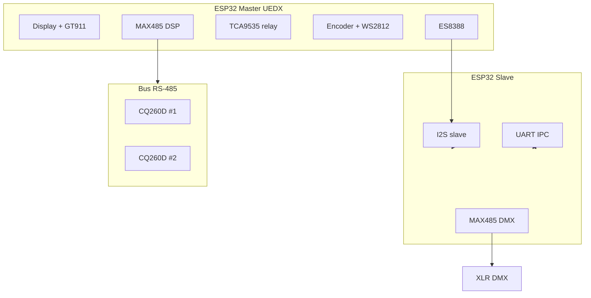

# Schemi di collegamento – DSP Control

## Documento ufficiale (unico)

| File | Contenuto |
|------|-----------|
| **[`SCHEMATIC_DSP_CONNECTIONS.html`](SCHEMATIC_DSP_CONNECTIONS.html)** | **Tutti i componenti**: alimentazione (Pololu, Buck, RJ45 Vaux), Master (ESP32, LCD, GT911, ES8388, I2S, TCA9535, relay, encoder, WS2812, MAX485 DSP, RJ45), Slave (IPC, I2S, DMX, XLR, relay, strobe), bus CQ260D, tabelle pin allineate a `config.h`. Stampa → PDF. |

I precedenti file multipli (`schematics_graphic.html`, `schematics_electric.html`, `schematics_print*.html`) sono stati **rimossi**: contenevano diagrammi duplicati o pin encoder non allineati al firmware.

---

## Cablaggio e datasheet (testo)

- **[`CABLING_COMPLETE.md`](CABLING_COMPLETE.md)** – BOM, RJ45, XLR audio, ORing, M144, checklist  
- **[`WIRING_GUIDE.md`](WIRING_GUIDE.md)** – Dual-ESP32 7 fili step-by-step  
- **[`PINOUT_REFERENCE.md`](PINOUT_REFERENCE.md)** – GPIO Master/Slave  
- **[`DATASHEETS_REFERENCE.md`](DATASHEETS_REFERENCE.md)** – Sintesi PDF  

---

## Architettura (Mermaid)

---

## RS-485 DSP (sintesi)

| Master | MAX485 | Bus |
|--------|--------|-----|
| GPIO43 → DI | A → RJ45 4 | CQ260D twisted pair |
| GPIO44 ← RO | B → RJ45 5 | 120 Ω solo ultimo nodo |
| GPIO10 → DE+/RE- (o auto-485) | GND | GND comune |

Baud **115200** 8N1.

---

## Riferimenti protocollo

| Documento | Contenuto |
|-----------|-----------|
| [`PROTOCOL_RS485_CQ260D.md`](PROTOCOL_RS485_CQ260D.md) | Frame RS-485 |
| [`DUAL_ESP32_INTEGRATION.md`](DUAL_ESP32_INTEGRATION.md) | IPC |

---

## Checklist pre-test

- [ ] A/B non invertiti sul primo CQ260D  
- [ ] GND comune Master ↔ bus  
- [ ] 5 V stabili  
- [ ] Flash prima Slave, poi Master  
- [ ] Log `[DSP_PROTO] Connessione riuscita`  
