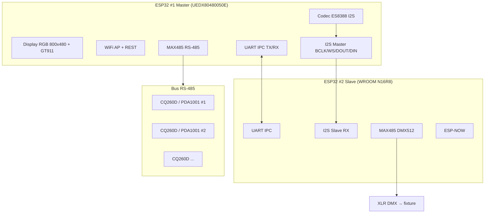

# Schemi di collegamento – DSP Control (Dual-ESP32 + CQ260D)

**Schema elettrico (componenti + pin datasheet):** [`schematics_electric.html`](schematics_electric.html)  
**Schemi grafici (blocchi):** [`schematics_graphic.html`](schematics_graphic.html)  
**Diagramma PNG:** [`schematica_architettura_dsp_control.png`](schematica_architettura_dsp_control.png)

**Cablaggio completo + estratto datasheet PDF:**  
→ **[`CABLING_COMPLETE.md`](CABLING_COMPLETE.md)** · **[`DATASHEETS_REFERENCE.md`](DATASHEETS_REFERENCE.md)**

Documento unico per cablaggio, massa e bus. Per stampa/PDF aprire anche  
**[`docs/schematics_print.html`](schematics_print.html)** nel browser → *Stampa → Salva come PDF*.

---

## 1. Architettura a blocchi



---

## 2. Master ↔ MAX485 ↔ DSP CQ260D (RS-485)

| Segnale | Master (GPIO) | MAX485 pin tipico | Verso CQ260D |
|---------|---------------|-------------------|--------------|
| TX | GPIO43 | DI (Data In) | — |
| RX | GPIO44 | RO (Receiver Out) | — |
| DE + /RE | GPIO10 | DE e /RE collegati insieme | — |
| — | GND | GND | GND |
| A | A | A | RS485 A (D+) |
| B | B | B | RS485 B (D−) |

**Regole:**

- **Terminazione**: resistenza **120 Ω** tra A e B solo all’**ultimo** modulo sulla linea (o solo sul Master se unico punto di terminazione previsto dallo schema amplificatore).
- **Cavo**: twisted pair schermato per lunghezze > 5 m; **GND comune** tra Master e primo modulo DSP (se il datasheet del modulo lo consente).
- **Baud rate**: **115200** 8N1 (allineato al firmware).

```text
                    ┌─────────────┐
   GPIO43 TX ──────►│ DI          │
   GPIO44 RX ◄──────│ RO   MAX485 │
   GPIO10 DE ───────│ DE,/RE      │
                    │ A ──────────┼──── A ────► verso CQ260D #1 ──┬──► #2 ──► ...
                    │ B ──────────┼──── B ────►                   │
                    └─────────────┘                                 │
                         GND ──────────────────────────────────────┘
```

---

## 3. Master ↔ ES8388 (I2S + I2C)

| Funzione | Master GPIO | ES8388 |
|----------|-------------|--------|
| I2S BCLK out | GPIO12 | BCLK |
| I2S WS/LRCK | GPIO13 | LRCK |
| I2S DIN (ADC) | GPIO11 | DOUT (codec → ESP) |
| I2S DOUT (DAC) | GPIO38 | DIN (ESP → codec) |
| I2C SDA | (config.h / board) | SDA |
| I2C SCL | (config.h / board) | SCL |

Indirizzo I2C tipico ES8388: **0x10**. MCLK: secondo modulo codec (spesso derivato da BCLK o oscillatore onboard).

---

## 4. Master ↔ Slave (7 fili + alimentazione)

Vedi anche [`WIRING_GUIDE.md`](WIRING_GUIDE.md).

| # | Da Master | A Slave | Segnale |
|---|-----------|---------|---------|
| 1 | GPIO12 | GPIO5 | I2S BCLK |
| 2 | GPIO13 | GPIO6 | I2S WS |
| 3 | ES8388 DOUT (fan-out) | GPIO7 | I2S DIN (stesso segnale del Master) |
| 4 | GPIO17 | GPIO2 | IPC UART TX→RX |
| 5 | GPIO18 | GPIO1 | IPC UART RX←TX |
| 6 | GND | GND | **Obbligatorio** |
| 7 | +5V (opz.) | 5V | Alimentazione Slave |

**Fan-out DOUT**: se cavi lunghi o più carichi, buffer **74LVC1G125** o simile tra ES8388 DOUT e le due destinazioni.

---

## 5. Slave ↔ DMX (MAX485 → XLR 3-pin)

| Slave GPIO | MAX485 | XLR |
|------------|--------|-----|
| GPIO8 | DI | — |
| GPIO9 | DE + /RE (HIGH fisso in TX) | — |
| — | A | Pin 3 (+) |
| — | B | Pin 2 (−) |
| GND | GND | Pin 1 (schermo) |

Terminazione **120 Ω** tra A e B sull’**ultima** fixture della catena DMX.

---

## 6. Identificazione cassa (beep)

Non esiste un comando RS-485 dedicato documentato per il CQ260D. Il firmware invia **impulsi di OutGain** (SET_PARAM) per generare picchi udibili sull’amplificatore quando è presente programma audio (o rumore di linea). Dopo ogni impulso il gain viene riportato a un valore di default sicuro.

---

## 7. Checklist pre-test (modulo DSP in arrivo)

- [ ] RS-485 A/B non invertiti rispetto al modulo
- [ ] GND comune Master ↔ linea DSP
- [ ] Alimentazione 5 V stabile su Master (e Slave se usato)
- [ ] Flash **prima** Slave, poi Master (I2S + IPC)
- [ ] Monitor seriale: messaggi `[DSP_PROTO] Connessione riuscita` dopo collegamento fisico
- [ ] Discovery da app o REST: elenco dispositivi dopo scan

---

## 8. Riferimenti

| Documento | Contenuto |
|-----------|-----------|
| [`PINOUT_REFERENCE.md`](PINOUT_REFERENCE.md) | Tabella GPIO completa |
| [`WIRING_GUIDE.md`](WIRING_GUIDE.md) | Dual-ESP32 step-by-step |
| [`PROTOCOL_RS485_CQ260D.md`](PROTOCOL_RS485_CQ260D.md) | Frame e comandi |
| [`DUAL_ESP32_INTEGRATION.md`](DUAL_ESP32_INTEGRATION.md) | IPC e ruoli |
